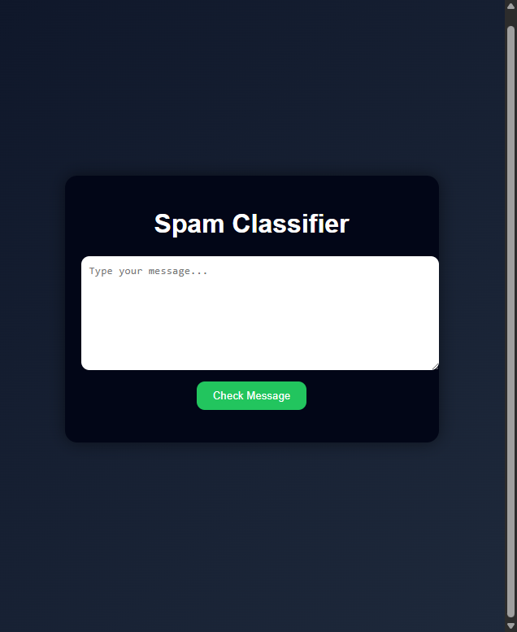

# 🚀 Spam Classifier (AI + FastAPI + Docker)

A **production-ready Machine Learning web application** that classifies messages as **Spam or Not Spam** with a confidence score.

---

# 📸 Screenshots



---

# 📌 Features

✅ Spam vs Not Spam detection  
✅ Confidence score (%)  
✅ Clean and modern UI  
✅ REST API with FastAPI  
✅ Fully Dockerized (multi-container)  
✅ Nginx reverse proxy setup  
✅ Ready for deployment

---

# 🧠 How It Works

1. User enters a message in UI
2. Frontend sends request → FastAPI backend
3. Backend:
   - Cleans text using NLP
   - Converts text → TF-IDF vector
   - Predicts using trained ML model
4. Returns:
   - Prediction (Spam / Not Spam)
   - Confidence score

---

# 📂 Project Structure

SPAM-CLASSIFIER/
├── backend/
│ ├── app/
│ │ ├── routes/
│ │ ├── schemas/
│ │ ├── services/
│ │ └── utils/
│ ├── model/
│ ├── train/
│ ├── Dockerfile
│ └── requirements.txt
│
├── frontend/
│ ├── index.html
│ ├── style.css
│ ├── app.js
│ ├── nginx.conf
│ └── Dockerfile
│
├── docker-compose.yml
└── README.md

---

# ⚙️ Tech Stack

| Layer      | Technology             |
| ---------- | ---------------------- |
| Frontend   | HTML, CSS, JavaScript  |
| Backend    | FastAPI                |
| ML Model   | Scikit-learn           |
| NLP        | NLTK                   |
| Deployment | Docker, Docker Compose |
| Server     | Nginx                  |

---

# 🚀 Getting Started

## 🔧 Prerequisites

- Docker
- Docker Compose

---

## ▶️ Run the Project

```bash
docker-compose up --build
🌐 Access the App

Frontend:

http://localhost:3000

Backend API Docs:

http://localhost:8000/docs
🧪 API Endpoint
POST /predict
Request:
{
  "message": "Congratulations! You won a free iPhone"
}
Response:
{
  "prediction": "Spam",
  "confidence": 69.1
}
🐳 Docker Hub Images

You can pull the images directly:

docker pull <your-dockerhub-username>/spam-classifier-backend
docker pull <your-dockerhub-username>/spam-classifier-frontend
📊 Example Predictions
Message	Result
"Win a free iPhone now!"	Spam
"Let's meet at 6 PM"	Not Spam
"Claim your reward now"	Spam

🔥 Future Improvements

🔐 User authentication (JWT)

📊 Analytics dashboard

☁️ Cloud deployment (AWS / Render)

📱 Mobile responsive UI

🤖 Deep learning model (LSTM/BERT)

👨‍💻 Author

Dhruv Sharma
B.E. Computer Science Engineering

⭐ Contribute

Feel free to fork and improve this project!
```
